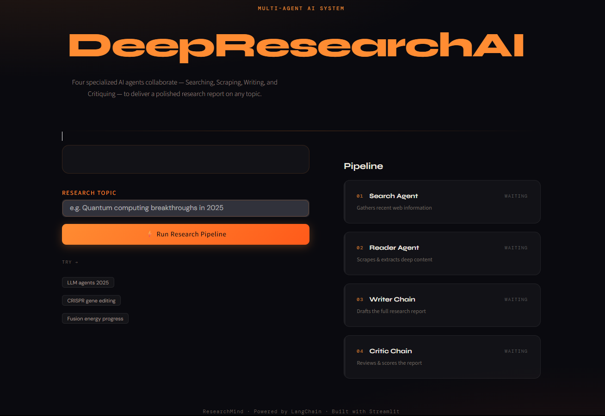

# 🤖 DeepResearch AI

> **Smarter. Faster. Autonomous Research.**  
> A premium multi-agent AI system that searches, analyzes, writes, and critiques high-quality research reports on any topic.


---

## 🚀 Live Project Preview

<p align="center">
  
</p>

---

## 🧠 Overview

**DeepResearch AI** is a powerful **multi-agent autonomous research assistant** built using modern LLM architecture.

Instead of generating shallow chatbot responses, multiple AI agents collaborate like a real research team to produce structured, polished, and valuable research reports in seconds.

This project demonstrates how next-generation AI systems are being built using **agentic workflows**.

---

## ✨ What It Does

✅ Searches recent information from the web  
✅ Scrapes and extracts deep insights  
✅ Writes professional research reports  
✅ Critiques and improves output quality  
✅ Produces final polished reports  
✅ Beautiful premium UI experience  

---

## 🤖 Multi-Agent Pipeline

DeepResearch AI uses four specialized AI agents:

### 🔍 Search Agent
Finds relevant and recent information from the web.

### 📄 Reader Agent
Scrapes sources and extracts useful insights.

### ✍️ Writer Chain
Creates polished and structured research reports.

### 🧐 Critic Chain
Reviews output quality and suggests improvements.

---

## 🖥️ UI Features

- Premium dark futuristic design  
- Startup-grade branding  
- Live pipeline visualization  
- Clean dashboard layout  
- Downloadable reports  
- Smooth user interaction  

---

## 🛠️ Tech Stack

- Python  
- LangChain  
- OpenAI / LLM APIs  
- Streamlit  
- Multi-Agent Systems  
- Prompt Engineering  
- Autonomous Pipelines  
- Web Search Tools  

---

## 📂 Project Structure

```bash id="ff5g3q"
.
├── app.py
├── agents.py
├── pipeline.py
├── tools.py
├── requirements.txt
├── ui.png
└── README.md

⚙️ Installation
Clone Repository
git clone https://github.com/shivamrustagi03/deepresearch-ai.git
cd deepresearch-ai
Install Requirements
pip install -r requirements.txt
Run Application
streamlit run app.py

💡 Example Research Topics
Future of AI Jobs in India
LLM Agents in 2026
Quantum Computing Breakthroughs
CRISPR Gene Editing Progress
Fusion Energy Market Outlook
Autonomous AI Startups

🎯 Why This Project Matters

This project demonstrates skills highly valued by recruiters.

AI / GenAI Skills
Multi-Agent Systems
LLM Integration
Prompt Engineering
Autonomous AI Workflows
AI Product Development
Engineering Skills
Modular Python Architecture
Frontend + Backend Integration
Real-World Deployment Thinking
Clean UI / UX Design

🔮 Future Improvements
Memory across sessions
PDF export reports
Multi-language research
Browser automation agent
Real-time citations
Team collaboration mode

👨‍💻 Author

Shivam Rustagi
AI Engineer | Data Science | Python Developer

🔗 GitHub: https://github.com/shivamrustagi03

⭐ Support

If you like this project, give it a Star ⭐ on GitHub.
